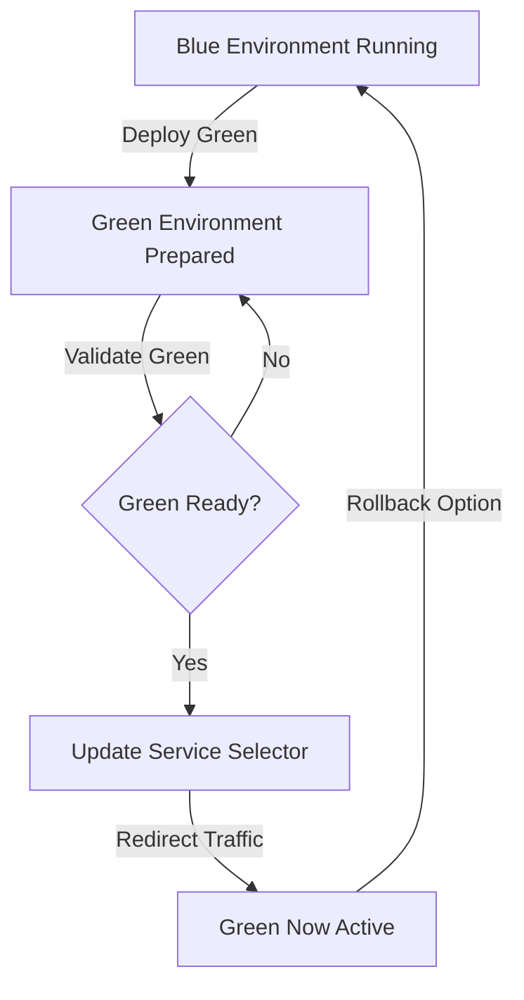

# Blue-Green Deployment Project

## Prerequisites
- Docker Desktop
- Minikube
- kubectl
- Helm
- Node.js
- Git

## Project Setup

### 1. Clone the Repository
```bash
git clone https://github.com/mohanDevOps-arch/Blue-green-Deployment.git
cd blue-green-project
```

### 2. Local Development

#### Backend Setup
1. Navigate to backend directory
2. Install dependencies
```bash
cd backend
npm install
```


3. Create `.env` file with:
```
PORT=5000
MONGO_URI=your-mongodb-connection-string
```


4. Start backend server
```bash
npm start
```


#### Frontend Setup
1. Setup Blue Frontend
```bash
cd frontend-blue
npm install
```


2. Create `.env` file:
```
PORT=3100
```
3. Start blue frontend
```bash
npm start
```


3. Repeat similar steps for Green Frontend (with PORT=3200)


### 3. Dockerization

#### Build Docker Images
# Build Backend Image
docker build -t your-username/backend:v1 ./backend


# Build Blue Frontend Image
docker build -t your-username/frontend-blue:v1 ./frontend-blue


# Build Green Frontend Image
docker build -t your-username/frontend-green:v1 ./frontend-green


### 4. Kubernetes Deployment

#### Minikube Setup
1. Start Minikube
```bash
minikube start
```


2. Enable Required Addons
```bash
minikube addons enable metrics-server
minikube addons enable ingress
```


### 5. Create Kubernetes Manifest Files

#### Required Manifest Files
Create following files in `k8s/` directory:
- `backend-deployment.yaml`
- `frontend-blue-deployment.yaml`
- `frontend-green-deployment.yaml`
- `frontend-service.yaml`
- `ingress.yaml`

#### Service File Key Concepts
Your `frontend-service.yaml` should:
- Use selector to route traffic
- Define version (blue/green)
- Map ports correctly

### 6. Deploy to Minikube
# Apply all manifests
kubectl apply -f k8s/


# Verify deployments
kubectl get deployments
kubectl get services
kubectl get pods


### 7. Blue-Green Switching

#### Switch Traffic Methods

1. Basic Patch Command
```bash
# Switch to Green
kubectl patch service frontend-service -p '{"spec":{"selector":{"version":"green"}}}'

# Switch back to Blue
kubectl patch service frontend-service -p '{"spec":{"selector":{"version":"blue"}}}'
```

2. Detailed Patch Command
```bash
kubectl patch service frontend-service --type='merge' -p '{
  "spec":{
    "selector":{
      "app":"frontend",
      "version":"green"
    }
  }
}'
```


### 8. Verification
- Check service endpoints
- Verify traffic routing
- Monitor application logs


### Troubleshooting
- `kubectl get pods` - Check pod status
- `kubectl logs <pod-name>` - View logs
- `kubectl describe service frontend-service` - Service details


### Cleanup
# Remove deployments
kubectl delete -f k8s/


# Stop Minikube
minikube stop


## Blue-Green Deployment Flow Chart



# Conclusion

This project successfully demonstrated containerization, orchestration, and Blue-Green deployment using Docker and Kubernetes. The backend, frontend applications, and MongoDB database were deployed and managed within a Minikube cluster.

The Blue-Green deployment strategy enabled a seamless transition between application versions by switching traffic through a Kubernetes Service selector. This approach provided zero-downtime deployment, simplified rollback, and improved application availability.

The implementation demonstrated practical knowledge of Docker, Kubernetes Deployments, Services, health checks, and modern DevOps deployment practices.
